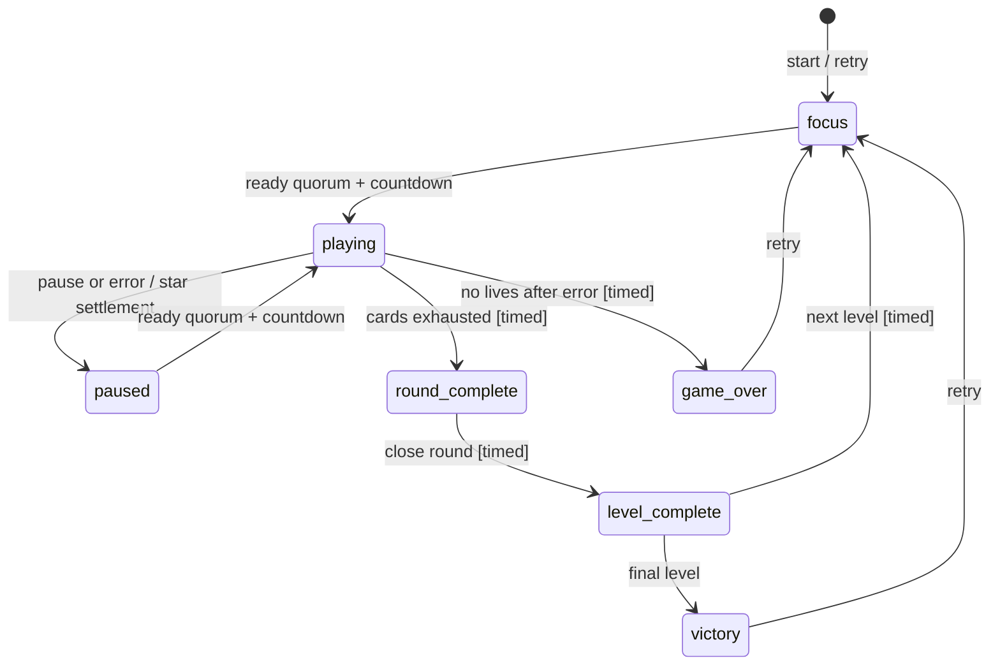

# Proposito del proyecto

The Hive es una implementacion web de un juego cooperativo de cartas en tiempo real donde varias personas deben jugar sus cartas en orden ascendente sin hablar ni darse senales, apoyandose en un ritmo compartido y en la lectura del grupo. La definicion base aparece en `README.md`, mientras que la logica autoritativa actual vive en `apps/backend/src/index.ts` y el cliente en `apps/frontend/src/App.tsx`.

# Contexto funcional

- El producto actual esta dividido en un backend Fastify + Socket.IO (`apps/backend`) y un frontend React + Vite (`apps/frontend`), coordinados en desarrollo por `docker-compose.yml`.
- El backend mantiene el estado de salas y partidas en memoria mediante `rooms`, `playerRoom` y `socketPlayer` dentro de `apps/backend/src/index.ts`; no se observo persistencia durable ni base de datos declarada en `apps/backend/package.json`.
- La experiencia ya cubre lobby multijugador, reconexion, ready cooperativo, juego sin turnos, penalizacion por errores, pausa, estrella por consenso, progresion de niveles, derrota, victoria y ranking final de sincronizacion. El shell permanece en `apps/backend/src/index.ts`; las decisiones viven en `domain/setup.ts`, `domain/round.ts`, `domain/cards.ts`, `domain/star.ts`, `domain/progression.ts` y `domain/scoring.ts`.
- El frontend conserva una sola pantalla principal en `apps/frontend/src/App.tsx` y apoya la UI con helpers puros como `roomSync.ts`, `connectionStatus.ts`, `gameUi.ts`, `lobbyUi.ts`, `handLayout.ts`, `starUi.ts`, `finalScoreUi.ts` y `messageTiming.ts`.
- `README.md` aun presenta el producto como "Fase 1 + base de Fase 2" y marca "Modo ciego" y "endurecer reglas avanzadas y anadir tests de motor" como trabajo futuro; esa documentacion parece parcialmente desactualizada frente a funcionalidades ya presentes como scoring final y modo CPU de desarrollo.

# Log de requerimientos

| Fecha | Requerimiento | Estado | Fuente |
| --- | --- | --- | --- |
| Desconocido | Soportar una experiencia cooperativa de cartas en tiempo real donde las cartas se juegan en orden ascendente sin comunicacion explicita. | Implementado | `README.md`, `apps/backend/src/index.ts` (`playCardInRoom`, `buildDeck`) |
| Desconocido | Permitir crear sala, unirse, abandonar, expulsar desde lobby y reconectar usando identidad persistente del jugador. | Implementado | `apps/backend/src/index.ts` (`room:create`, `room:join`, `room:leave`, `room:kick`, `room:resync`), `apps/frontend/src/App.tsx` (`STORAGE_KEYS`, auto-join) |
| Desconocido | Iniciar manualmente por host con dos conectados; usar ready cooperativo solo para reanudar la ronda desde `focus` o `paused`, excluyendo conectados sin cartas del quorum. | Implementado | `apps/backend/src/domain/setup.ts`, `apps/backend/src/domain/round.ts`, `apps/backend/src/gameStateMachine.ts` |
| Desconocido | Aplicar penalizacion de vida y descarte automatico cuando se juegue por encima de cartas menores aun ocultas. | Implementado | `apps/backend/src/domain/cards.ts` (`playCard`, `expireCardEffect`), `apps/backend/src/index.ts` (`playCardWithDomain`) |
| Desconocido | Resolver una estrella solo por consenso y descartar la carta mas baja de cada mano no vacia tras el cierre visual. | Implementado | `apps/backend/src/domain/star.ts`, `apps/backend/src/starAnimation.ts`, handlers `star:*` de `apps/backend/src/index.ts` |
| Desconocido | Mostrar un ranking final de sincronizacion con puntuacion, banda de timing y feedback textual por jugador. | Implementado | `apps/backend/src/domain/scoring.ts`, `apps/backend/src/domain/progression.ts`, `apps/frontend/src/finalScoreUi.ts` |
| Desconocido | Ofrecer un modo ciego de juego boca abajo con validacion al final del nivel. | Pendiente | `README.md` |
| Desconocido | Endurecer reglas avanzadas y anadir tests de motor. | Pendiente | `README.md` |
| 2026-07-18 | Inicio manual por host sin ready previo; contradice README. | Por confirmar | `index.ts` (`game:start`), `lobbyRules.ts` |
| 2026-07-18 | `availableActions` es consejo UI; handlers siguen siendo autoridad. | Por confirmar | `privateState.ts`, handlers |
| 2026-07-18 | Desconectados conservan cartas sin TTL; identidad por `playerId` y host migran. | Por confirmar | `markSocketDisconnected`, `room:join`, `pickNextHost` |
| 2026-07-18 | Balance, ready y consenso usan criterios distintos de registro/conexión/cartas. | Por confirmar | `startGameInRoom`, `roundParticipants.ts`, estrella |
| 2026-07-18 | Leave en partida, scoring, versiones, estrella tras disconnect y terminales son ambiguos. | Por confirmar | `index.ts` |
 | 2026-07-18 | `room:kick` solo está implementado en backend. | Por confirmar | `index.ts` |
| 2026-07-18 | El tráfico que cumple el contrato Socket.IO conserva eventos, campos legacy, versiones y acks; input malformado se rechaza sin mutar la partida ni cerrar la conexión. | Implementado | `packages/contracts`, handlers Socket.IO |
| 2026-07-18 | El estado público no puede incluir mano ni `socketId`; la mano y acciones pertenecen exclusivamente al envelope privado del propietario. | Implementado | `packages/contracts/src/state.ts`, serializers |

# Funcionalidades

- Lobby y presencia: crear sala, unirse, expulsar, detectar host, mostrar jugadores conectados y logs de sala; evidencia en `apps/backend/src/index.ts` y helpers de UI en `apps/frontend/src/lobbyUi.ts`.
- Reconexion y resync: el cliente persiste `playerId`, `playerName` y ultima sala; el backend admite rejoin por `playerId` y devuelve snapshots versionados mediante `room:resync`; evidencia en `apps/frontend/src/App.tsx` y `apps/backend/src/index.ts`.
- Estado publico y estado privado: `serializeRoom()` publica solo datos seguros como `handCount`, mientras `buildPrivateState()` y `player:state` entregan la mano y acciones disponibles por socket; evidencia en `apps/backend/src/index.ts` y `apps/backend/src/privateState.ts`.
- Rondas cooperativas: countdown, locks de interaccion, foco, juego activo, pausa y reanudacion por ready; `domain/round.ts` decide ready, pausa y expiraciones, mientras `index.ts` materializa sus efectos temporales. Evidencia adicional en `apps/backend/src/gameTiming.ts` y `apps/frontend/src/gameUi.ts`.
- Regla de carta mas baja: `domain/cards.ts` acepta solo una carta presente y minima de la mano del actor, registra una entrada manual con reloj inyectado y limpia una propuesta de estrella activa.
- Penalizacion por error: `domain/cards.ts` calcula y ordena todas las bloqueantes, pierde una vida con suelo cero, incrementa una vez el error del actor, descarta esas cartas y declara el overlay/error y su outcome; `index.ts` solo traduce los hechos a `game:error-penalty` y logs.
- Estrella cooperativa: `domain/star.ts` posee propuesta, votos, consenso, consumo unico, preview y settlement idempotente; `starAnimation.ts` solo espera acks, desconexion o deadline visual antes de devolver el settlement al dominio. Evidencia adicional en `apps/backend/src/index.ts` y `apps/frontend/src/starUi.ts`.
- Progresion de niveles: `domain/setup.ts` posee balance, estrella inicial, mapa de recompensas, inicio/retry y reparto; `domain/progression.ts` posee recompensa con topes, avance, derrota, victoria y el cierre final. El shell solo programa sus efectos declarados. 
- Ranking final: `domain/scoring.ts` calcula desviacion temporal, penalizacion por errores, bandas, mensajes y orden estable a partir de `completedAt` inyectado; conserva el historial vigente que setup reinicia por nivel.
- Modo dev-cpu: codigos `CPUON1` a `CPUON7` crean salas con CPU auto-ready para pruebas; evidencia en `apps/backend/src/index.ts` (`parseCpuRoomCode`, `createCpuRoom`, `scheduleCpuTurn`).
- Ready baseline: `game:start` es manual por host con al menos dos conectados y sin ready previo. En `focus`/`paused` solo conectados con cartas participan; una mano vacia no bloquea ready pero si participa en consenso de estrella.
- Privacidad: broadcasts revelan contadores, pila e historial ya revelado; mano y acciones son privadas. `rewardMap`, `startedAt`, `errorCounts`, Maps, timers y resoluciones pendientes son internos.

# Glosario de terminos

| Termino | Definicion | Evidencia |
| --- | --- | --- |
| Sala | Contenedor de partida con codigo, host, jugadores, logs, version y estado de juego. | `apps/backend/src/index.ts` (`type Room`) |
| Jugador | Participante humano o CPU con identidad estable, conexion, ready y mano privada. | `apps/backend/src/index.ts` (`type Player`) |
| Host | Jugador con permisos para iniciar o reintentar la partida y expulsar en lobby. | `apps/backend/src/index.ts` (`game:start`, `game:retry`, `room:kick`) |
| Ready | Estado de preparacion usado para auto-inicio en lobby y para reanudar rondas despues de foco o pausa. | `apps/backend/src/index.ts` (`player:ready`), `apps/backend/src/roundParticipants.ts` |
| Pila | Secuencia publica de cartas ya jugadas, separada del historial detallado `pileHistory`. | `apps/backend/src/index.ts` (`GameState.pile`, `GameState.pileHistory`) |
| Vida | Recurso compartido que baja con errores y provoca derrota al llegar a cero. | `apps/backend/src/domain/cards.ts`, `apps/backend/src/domain/progression.ts` |
| Estrella | Recurso cooperativo consumible por consenso para descartar la carta mas baja de cada jugador con cartas. | `apps/backend/src/index.ts` (`star:*`, `resolveStarIfEveryoneAccepted`) |
| Bloqueo de interaccion | Ventana temporal donde acciones como ready, jugar o estrella se rechazan por transicion activa. | `apps/backend/src/gameTiming.ts`, `apps/backend/src/index.ts` (`hasActiveInteractionLock`) |
| Snapshot de sala | Envelope versionado que combina `publicState` y `privateState` para mantener sincronizado al cliente. | `apps/backend/src/index.ts` (`createRoomSnapshot`), `apps/frontend/src/roomSync.ts` |
| Modo dev-cpu | Variante de desarrollo donde el backend agrega jugadores CPU y programa sus jugadas automaticamente. | `apps/backend/src/index.ts` (`parseCpuRoomCode`, `createCpuRoom`, `scheduleCpuTurn`) |

# Maquina de estados de partida

La fuente canónica de autorización es `apps/backend/src/gameStateMachine.ts`. Las fases son públicas; locks y settlement de estrella son ejes ortogonales y no fases adicionales. La UI presenta fases, locks y animaciones, pero solo las capacidades privadas autorizan comandos.

## Límite de dominio en migración

- `apps/backend/src/domain/model.ts` define el estado funcional de partida, jugador y juego sin código de sala, socket, versión, logs ni timers; `domainAdapter.ts` conserva esa metadata del shell al copiar y fusionar resultados.
- `domain/participants.ts` es el propietario de las cinco poblaciones confirmadas: ready, play y pause incluyen conectados con cartas; consenso incluye conectados incluso sin cartas; settlement incluye toda mano no vacía incluso desconectada.
- `gameStateMachine.ts` sigue siendo la autoridad única de fase, actor, lock, expiración y terminales. `domain/setup.ts` posee setup/retry/reparto, `domain/round.ts` ready/pausa/countdown, `domain/cards.ts` juego/penalización/descartes, `domain/star.ts` estrella, `domain/progression.ts` recursos/progreso/terminales y `domain/scoring.ts` ranking.

| Fase | Significado e invariantes | Acciones de dominio |
| --- | --- | --- |
| `focus` | Cartas repartidas; ready solo incluye conectados con cartas. | ready/unready; el quórum inicia countdown. |
| `playing` | Ronda activa sin turnos; jugar exige la carta mínima propia. | play, pause, propuesta/voto de estrella. |
| `paused` | Reconcentración; solo quienes conservan cartas vuelven a ready. | ready/unready. |
| `round-complete` | Ventana de cierre de cartas agotadas. | solo transición temporizada. |
| `level-complete` | Nivel resuelto y recompensa aplicada. | solo avance temporizado o victoria. |
| `game-over` / `victory` | Partida terminal con resultados finales. | retry por host (el protocolo conserva compatibilidad fuera de la ventana visual). |

Políticas independientes: ready y juego/pausa usan conectados con cartas; consenso incluye todo conectado, incluso sin cartas; settlement considera a cualquiera que tenga cartas, aun si está desconectado. Inicio sigue siendo manual por host con dos conectados, sin exigir ready.

Invariantes confirmadas de setup y ronda: el balance soportado es 2--8 jugadores (`maxLevel`/vidas: 2=12/2, 3=10/3, 4--5=8/4, 6=7/5, 7=6/5, 8=5/5); el inicio y retry crean nivel 1, una estrella, mapa de recompensas truncado al nivel maximo y manos ordenadas tomadas secuencialmente del mazo inyectado. Inicio conserva el ready humano existente y marca ready a CPU; retry y reparto de nivel reinician ready humano a `false` y marcan ready a CPU. Ready y pausa no mutan su entrada; ambos vuelven a conectar y marcar ready a CPU, y una pausa borra ready solo de conectados con cartas. Un quorum completo declara countdown con `dueAt`, fase, razon y deadline esperados; su expiracion solo opera si esas tres expectativas aun coinciden y el deadline ya vencio.

Invariantes confirmadas de cartas: una jugada valida contiene la carta minima propia y se registra una sola vez en pila e historial con `now` inyectado. Las bloqueantes son todas las cartas menores aun en cualquier mano, ordenadas por valor e identidad; una penalizacion pierde exactamente una vida sin bajar de cero, suma un error al actor y descarta cada bloqueante. El dominio declara los efectos de error y de flip/unflip con fase, lock y deadline esperados; un callback vencido o stale no muta. Tras el overlay, el hecho de continuidad expresa pausa, nivel completo o derrota sin que el shell recalcule bloqueantes o el outcome; la CPU se programa solo despues de una jugada aceptada que continua la ronda.

Invariantes confirmadas de estrella: el proponente se autoacepta y CPU conectada se autoacepta; el consenso exige a toda persona conectada, incluso sin cartas, pero el preview y settlement incluyen cada mano no vacia, incluso desconectada. Al consenso se consume una estrella exactamente una vez, se guarda un preview sin mutar manos y se declara un lock `star` con deadline. El settlement solo acepta las expectativas originales de fase, razon y deadline, elimina exactamente las cartas del preview una vez y declara pausa o cierre de ronda sin que el shell recalcule la regla. Los acks, sockets, desconexion y timeout visual no pertenecen al dominio.

Invariantes confirmadas de progresion y final: al completar un nivel se consulta una sola recompensa y se aplica una vez, con vidas limitadas a cinco y estrellas a tres. La maquina autoriza el cierre, el avance, la liberacion de readiness y las terminales; los efectos conservan fase, lock y deadline, por lo que un callback stale no reparte ni inicia otra ronda. El siguiente nivel usa el reparto de setup y mantiene el lock observable `level-complete`. Derrota y victoria calculan una vez el ranking sobre el `pileHistory` vigente, con `completedAt` inyectado; el ranking ordena por puntuacion descendente, desviacion ascendente y nombre.

Las aristas temporizadas se validan contra la fase y lock/deadline esperados; callbacks obsoletos no cambian la partida.
